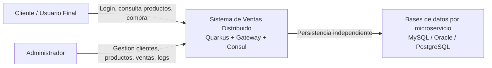
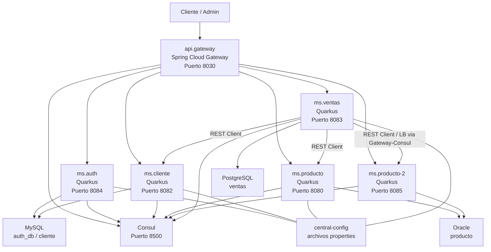
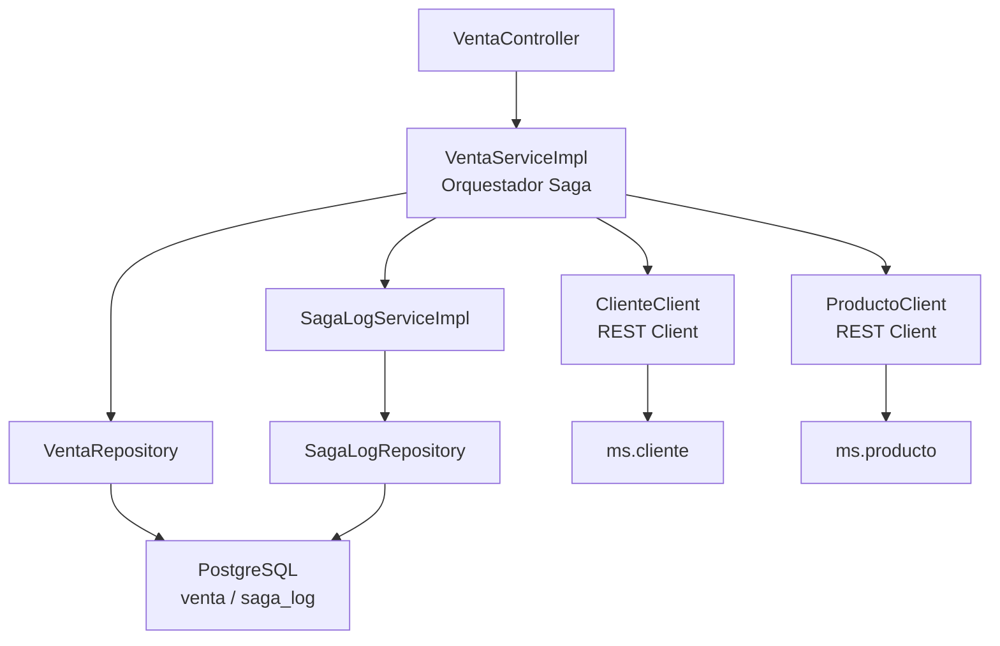
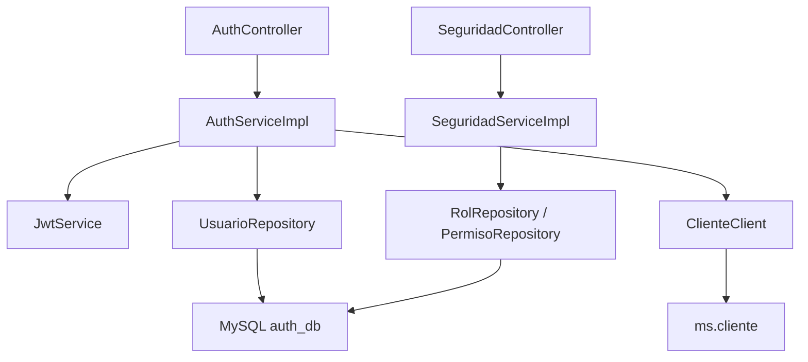
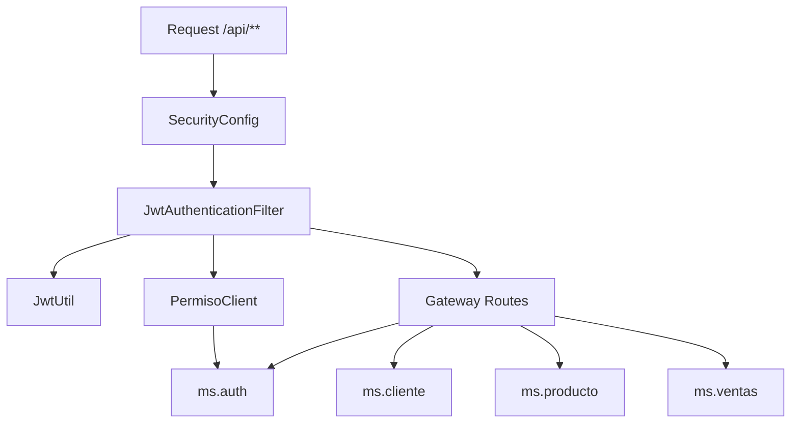
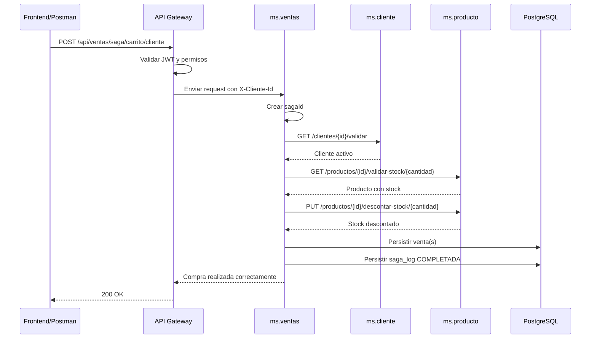
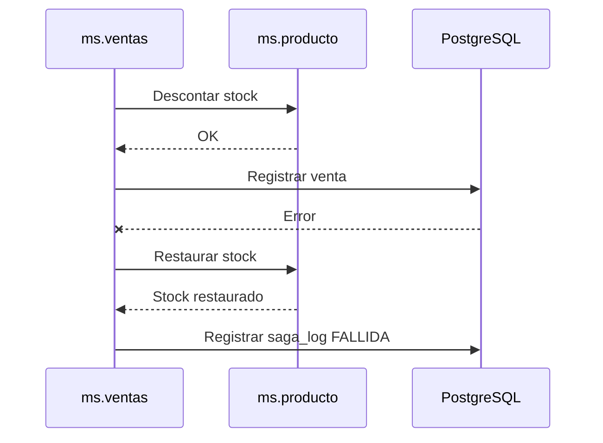

# Diagramas C4

## Nota Tecnica

El proyecto usa microservicios Quarkus, Spring Cloud Gateway como API Gateway y Consul como registro/descubrimiento. Esta decision fue permitida por el docente, aunque la guia base mencione otras tecnologias.

## C1 - Context Diagram

Descripcion:

El sistema permite a clientes comprar productos y al administrador gestionar el negocio. La comunicacion externa entra por el API Gateway. Los microservicios mantienen bases separadas para cumplir independencia de datos.

## C2 - Container Diagram

Descripcion:

El gateway enruta todas las solicitudes oficiales bajo `/api`. Consul registra los servicios y permite balanceo hacia instancias como `ms-producto` y `ms-producto-2`. Cada microservicio tiene su base correspondiente.

## C3 - Component Diagram: ms.ventas

Descripcion:

`ms.ventas` contiene el orquestador de la Saga. Valida cliente, valida stock, descuenta stock, registra ventas y ejecuta compensacion si corresponde. Tambien guarda logs de Saga para auditoria.

## C3 - Component Diagram: ms.auth

Descripcion:

`ms.auth` gestiona login, registro de clientes, roles y permisos. Al registrar un cliente, crea primero el cliente en `ms.cliente` y luego el usuario con `ROLE_CLIENTE`.

## C3 - Component Diagram: api.gateway

Descripcion:

El gateway valida JWT, obtiene permisos del rol y enruta a los microservicios. Las rutas oficiales para pruebas y frontend son las del gateway.

## C4 - Code Diagram: Saga de Venta con Carrito

## C4 - Code Diagram: Compensacion

## Evidencias del Modelado

- Captura del PDF C4 generado.
- Captura de Consul con servicios registrados.
- Captura del flujo Saga exitosa en Postman.
- Captura de Saga fallida y `saga-logs`.

