# Evidencias de pruebas y ejecucion

Este documento concentra las capturas usadas para demostrar que el sistema funciona de acuerdo con los entregables del proyecto.

## 1. Dockerizacion

Evidencia de los contenedores levantados con Docker Compose.

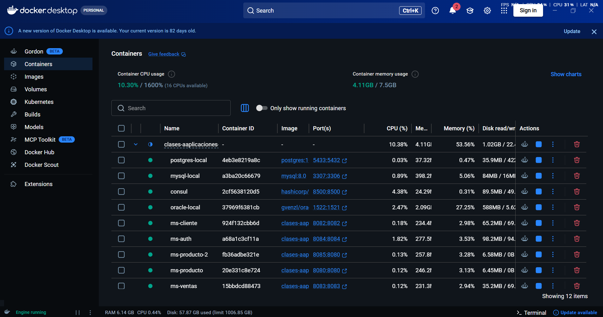

En la captura se observan los contenedores principales del sistema en ejecucion: bases de datos, Consul, ms-auth, ms-cliente, ms-producto, ms-producto-2 y ms-ventas. Tambien se evidencian los puertos expuestos de los servicios.

## 2. Registro y descubrimiento con Consul

Evidencia de los microservicios registrados en Consul.

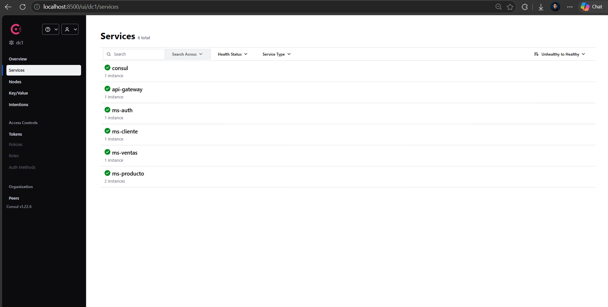

En la captura se observan los servicios registrados y saludables en Consul: consul, api-gateway, ms-auth, ms-cliente, ms-ventas y ms-producto. Tambien se evidencia que ms-producto cuenta con 2 instancias, lo cual respalda el entregable de balanceo de carga.

## 3. Seguridad JWT

Evidencia del inicio de sesion y uso del token JWT.

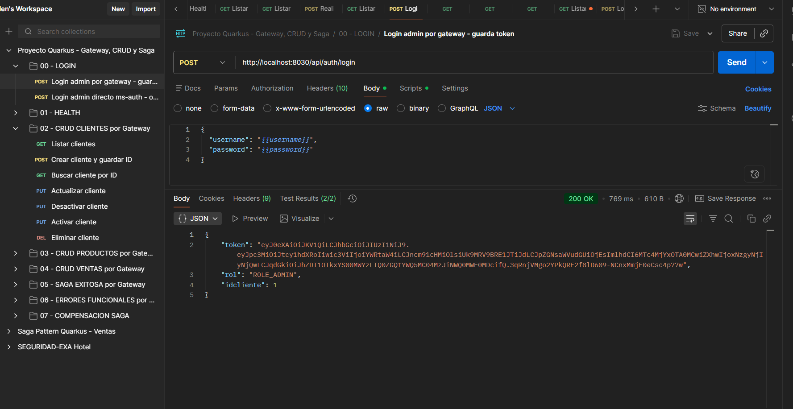

La captura muestra el endpoint POST http://localhost:8030/api/auth/login consumido por medio del API Gateway. La respuesta es 200 OK y devuelve un token, el rol ROLE_ADMIN y el idcliente, demostrando la autenticacion con JWT.

## 4. API Gateway

Evidencia de consumo de endpoints por medio del gateway.

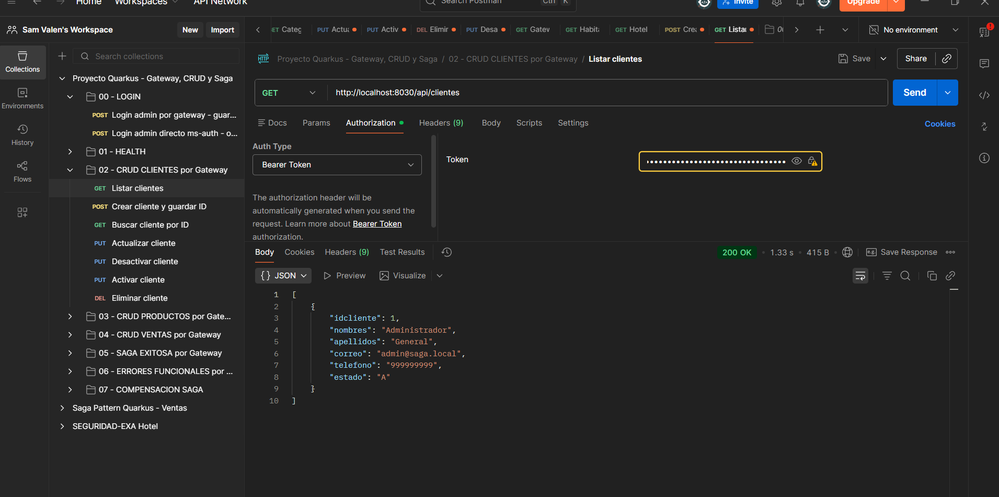

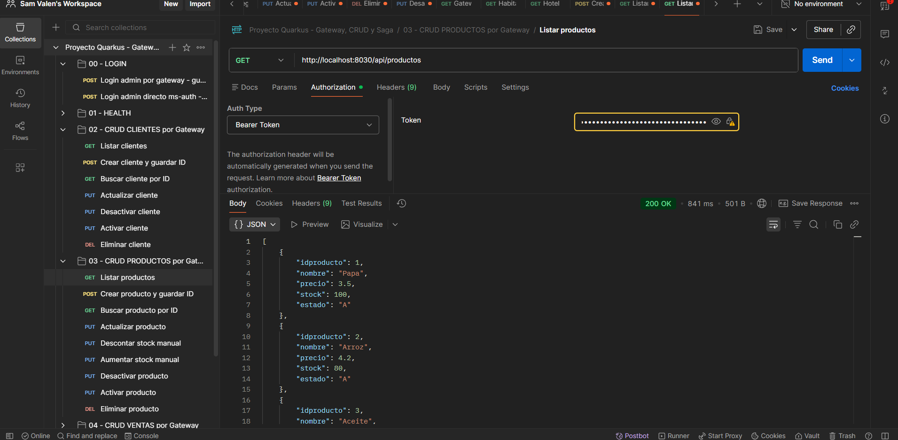

Las capturas muestran peticiones realizadas por medio de http://localhost:8030/api/... usando autorizacion Bearer Token. Esto evidencia que el API Gateway centraliza el acceso y que los endpoints protegidos pueden consumirse con JWT.

## 5. CRUD de clientes

Evidencia de listar, crear, actualizar y desactivar clientes.

La captura evidencia el listado de clientes mediante GET http://localhost:8030/api/clientes, usando token JWT y obteniendo respuesta 200 OK.

Como evidencia complementaria, el frontend administrativo muestra gestion de clientes en la seccion 15. Las operaciones se consumen por API Gateway con Bearer Token.

## 6. CRUD de productos

Evidencia de listar, crear, actualizar y eliminar/desactivar productos.

La captura evidencia el listado de productos mediante GET http://localhost:8030/api/productos, usando token JWT y obteniendo respuesta 200 OK.

Como evidencia complementaria, el frontend administrativo muestra gestion de productos e inventario en la seccion 15.

## 7. Ventas

Evidencia de ventas registradas correctamente.

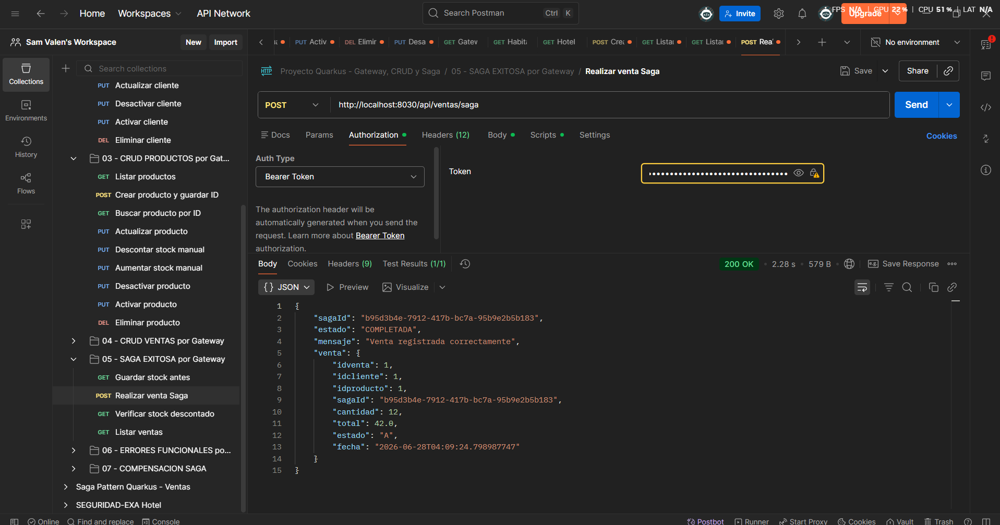

La captura muestra una venta registrada mediante POST http://localhost:8030/api/ventas/saga, usando Bearer Token. La respuesta es 200 OK, estado COMPLETADA, e incluye sagaId, datos de la venta, cantidad, total y fecha.

## 8. Saga exitosa

Evidencia del flujo completo:

1. Validar cliente.
2. Validar producto.
3. Descontar stock.
4. Registrar venta.

La captura muestra la ejecucion exitosa de la Saga por medio del API Gateway. El servicio ms.ventas orquesta el flujo y responde con estado COMPLETADA, confirmando que la venta fue registrada correctamente y asociada a un sagaId.

El descuento de stock queda evidenciado en las pruebas de Saga exitosa, compensacion y vista administrativa de productos.

## 9. Saga fallida por stock insuficiente

Evidencia del error controlado cuando no existe stock suficiente.

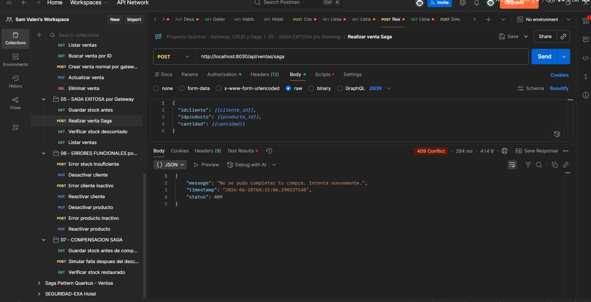

La captura muestra una solicitud POST http://localhost:8030/api/ventas/saga con una cantidad mayor al stock disponible. El sistema responde 409 Conflict con un mensaje controlado para el cliente: No se pudo completar tu compra. Intenta nuevamente. Esto evidencia el manejo de errores funcionales dentro del flujo Saga.

La respuesta controlada evita registrar ventas cuando no hay stock suficiente. La compensacion de stock se evidencia en la seccion 11.

## 10. Saga fallida por cliente inactivo

Evidencia del error controlado cuando el cliente esta desactivado.

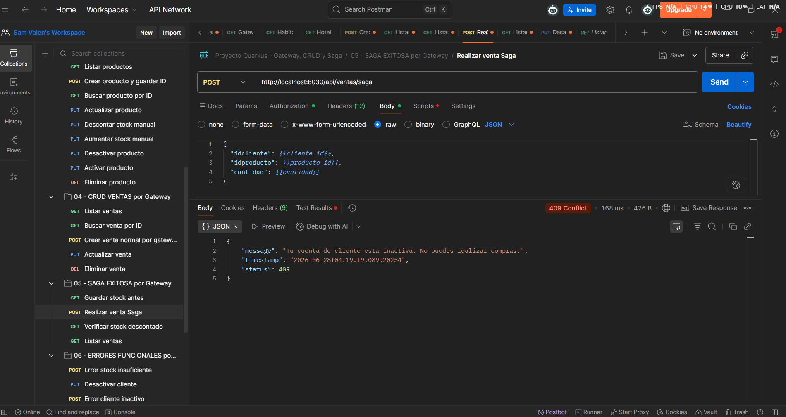

La captura muestra una solicitud POST http://localhost:8030/api/ventas/saga realizada con un cliente en estado inactivo. El sistema responde 409 Conflict con el mensaje: Tu cuenta de cliente esta inactiva. No puedes realizar compras. Esto confirma que la Saga valida el estado del cliente antes de continuar con la venta.

## 11. Compensacion de Saga

Evidencia de restauracion de stock cuando ocurre un error despues del descuento.

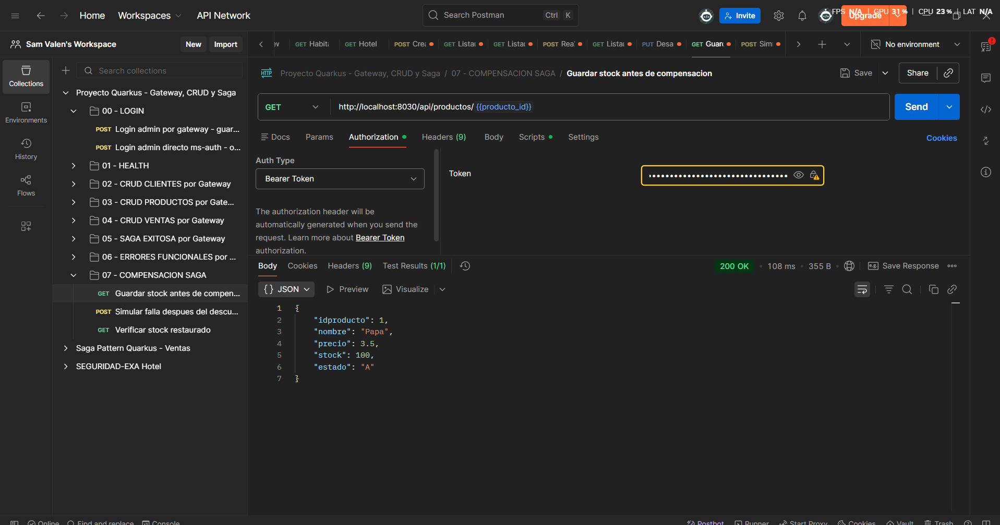

La captura muestra el stock inicial del producto Papa antes de simular una falla posterior al descuento. El producto tiene stock 100, valor que se usara como referencia para comprobar que la compensacion restaura correctamente el stock.

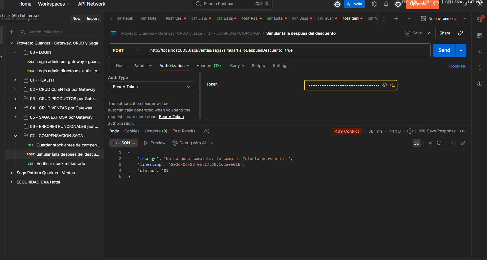

La captura muestra la simulacion de una falla despues de descontar stock mediante POST http://localhost:8030/api/ventas/saga?simularFalloDespuesDescuento=true. El sistema responde 409 Conflict con el mensaje controlado para el cliente: No se pudo completar tu compra. Intenta nuevamente.

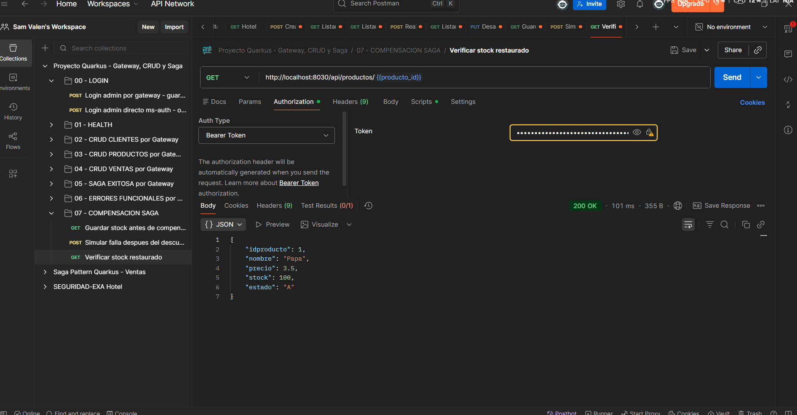

La captura confirma que, despues del error controlado, el stock del producto Papa vuelve a 100. Esto demuestra que ms.ventas ejecuto la compensacion llamando a ms.producto para restaurar el stock descontado.

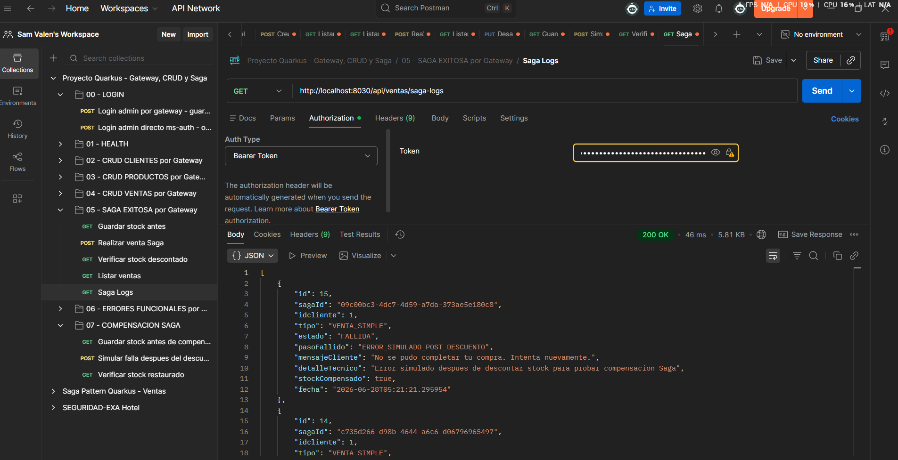

La captura del endpoint GET http://localhost:8030/api/ventas/saga-logs muestra el registro fallido con pasoFallido ERROR_SIMULADO_POST_DESCUENTO y stockCompensado en true, confirmando que la compensacion quedo auditada.

## 12. Logs de Saga

Evidencia del historial administrativo de pasos exitosos y fallidos.

La captura evidencia el historial administrativo de Saga. Se observa el sagaId, idcliente, tipo VENTA_SIMPLE, estado FALLIDA, paso fallido, mensaje visible para cliente, detalle tecnico y el indicador stockCompensado en true.

## 13. Resiliencia en ms.ventas

Evidencia de circuit breaker, fallback y timeout.

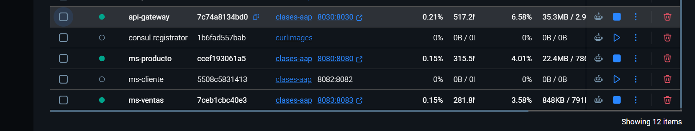

La captura muestra el contenedor ms-cliente detenido, simulando indisponibilidad del microservicio de clientes.

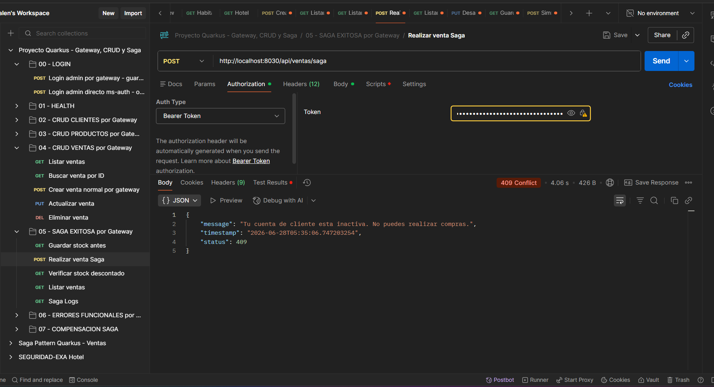

La captura muestra que, al ejecutar POST http://localhost:8030/api/ventas/saga con ms-cliente no disponible, el sistema responde con 409 Conflict y un mensaje controlado. Esto evidencia que ms.ventas mantiene el flujo Saga protegido ante la caida de una dependencia externa.

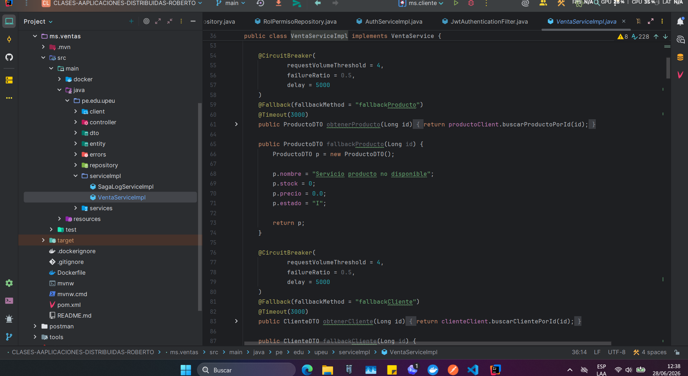

La captura muestra la implementacion de resiliencia en VentaServiceImpl mediante `@CircuitBreaker`, `@Fallback` y `@Timeout` para las llamadas REST hacia ms-producto y ms-cliente. Esta evidencia complementa la prueba funcional donde ms-cliente fue detenido y la Saga respondio con un error controlado.

## 14. Balanceo de carga

Evidencia de dos instancias de producto atendiendo solicitudes.

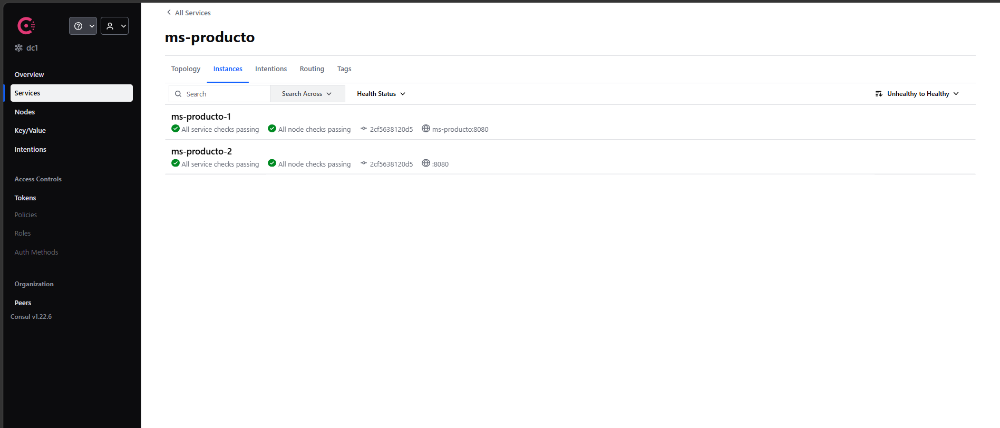

La captura de Consul muestra el servicio ms-producto con dos instancias registradas y saludables: ms-producto-1 y ms-producto-2.

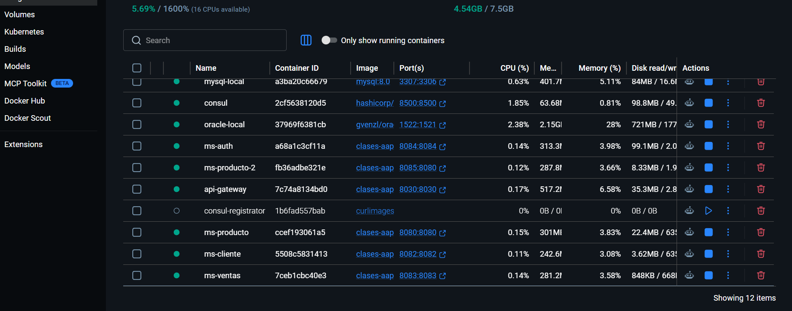

La captura de Docker Desktop confirma que existen dos contenedores del microservicio de productos ejecutandose al mismo tiempo, uno expuesto por el puerto 8080 y otro por el puerto 8085. Esto respalda la configuracion preparada para balanceo de carga desde el API Gateway/Consul.

La evidencia visual confirma dos instancias saludables y ejecutandose. En la sustentacion se explica que el gateway enruta hacia el nombre logico del servicio registrado en Consul.

## 15. Frontend

Evidencia del frontend conectado al backend.

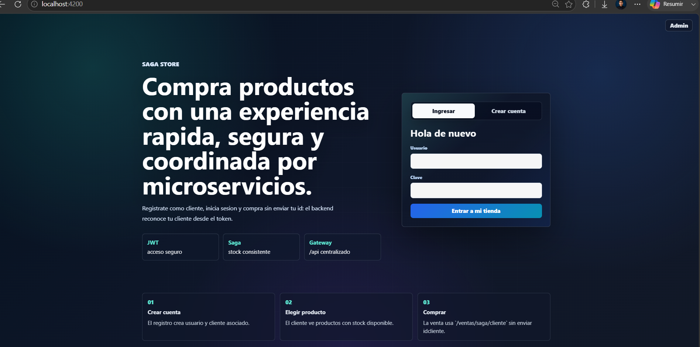

La captura muestra la pantalla de login del frontend Angular en http://localhost:4200, con acceso para cliente y opcion de administrador. Esta vista evidencia la interfaz inicial del sistema y la integracion prevista con autenticacion JWT, Saga y API Gateway.

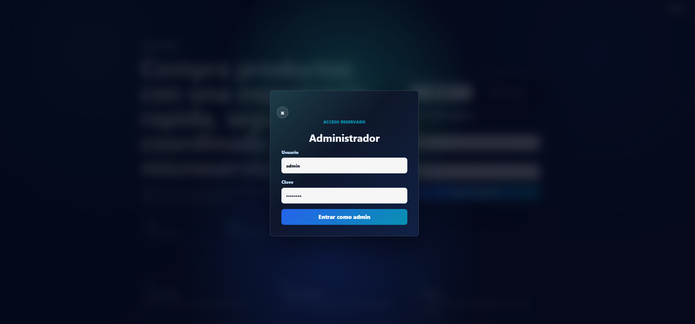

La captura muestra el acceso reservado para administrador desde el frontend.

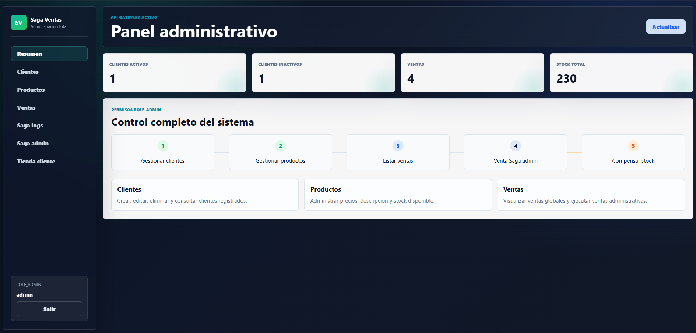

La captura muestra el dashboard administrativo con resumen de clientes, ventas y stock, consumiendo informacion del backend por medio del API Gateway.

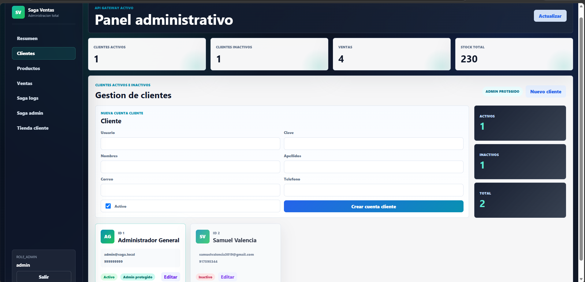

La captura muestra la administracion de clientes, incluyendo cliente administrador protegido y cliente inactivo.

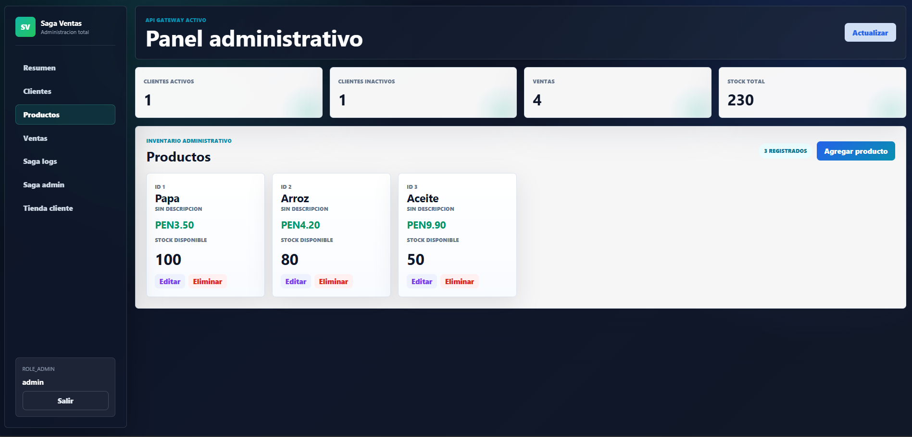

La captura muestra el inventario administrativo de productos con precios y stock.

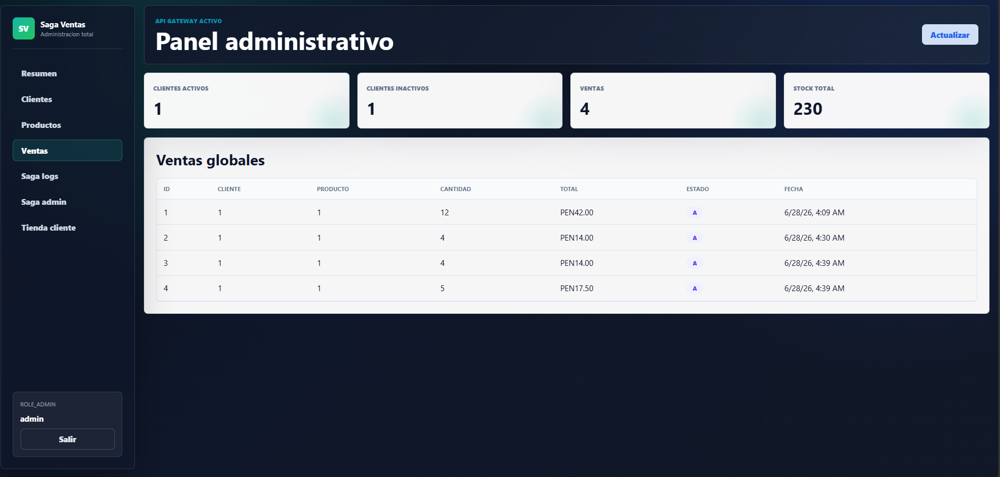

La captura muestra el listado administrativo de ventas globales.

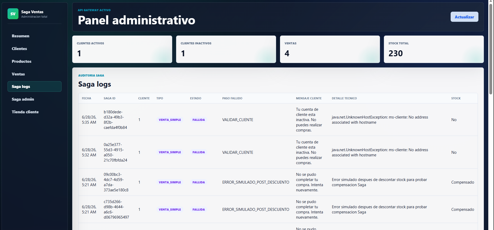

La captura muestra el historial administrativo de Saga, incluyendo errores por cliente no disponible y compensaciones de stock.

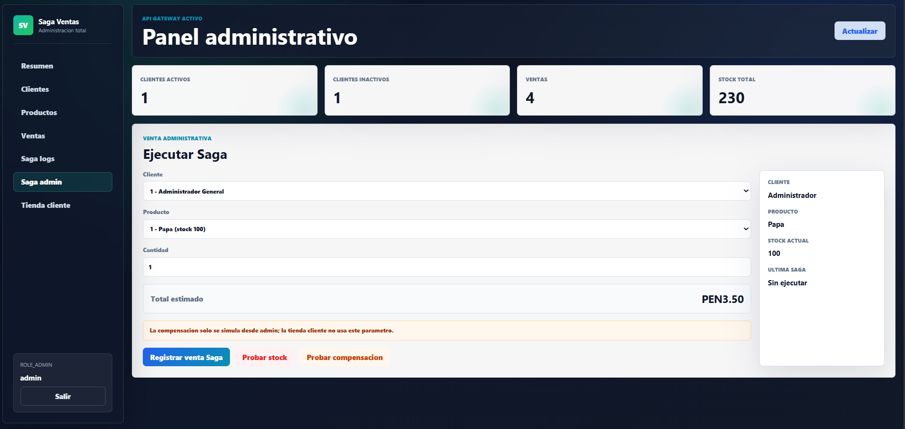

La captura muestra el apartado administrativo para ejecutar una venta Saga y probar escenarios de stock o compensacion.

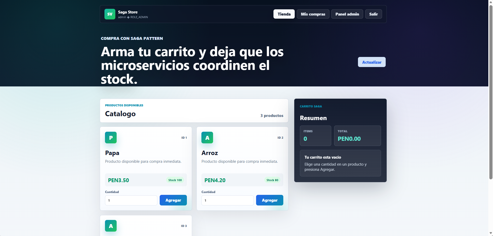

La captura muestra que el usuario administrador tambien puede acceder al apartado de tienda cliente para comprar productos mediante el flujo de carrito y Saga.

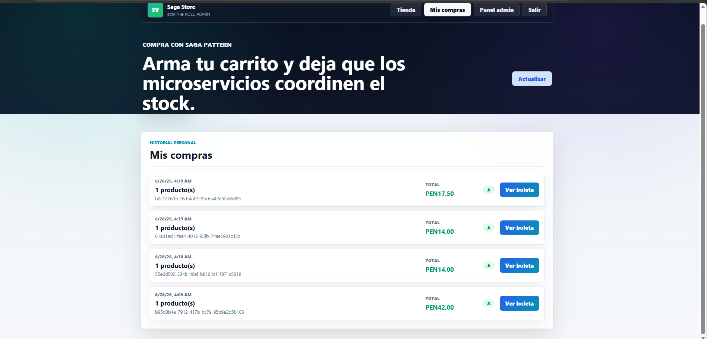

La captura muestra el historial personal de compras del administrador cuando usa el sistema como cliente.

## 16. Integracion frontend-backend

Evidencia de consumo real de endpoints desde Angular hacia el API Gateway.

Las capturas del frontend muestran los modulos consumiendo datos reales del backend: resumen, clientes, productos, ventas, Saga logs, Saga admin, tienda y mis compras. La configuracion del frontend usa el API Gateway como entrada principal.

