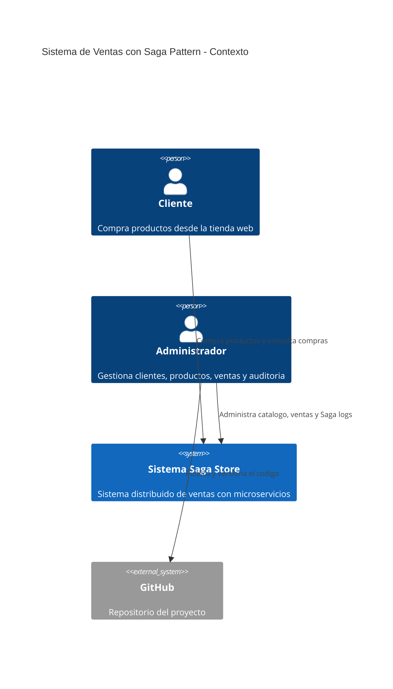
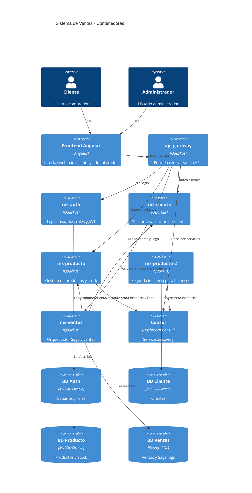
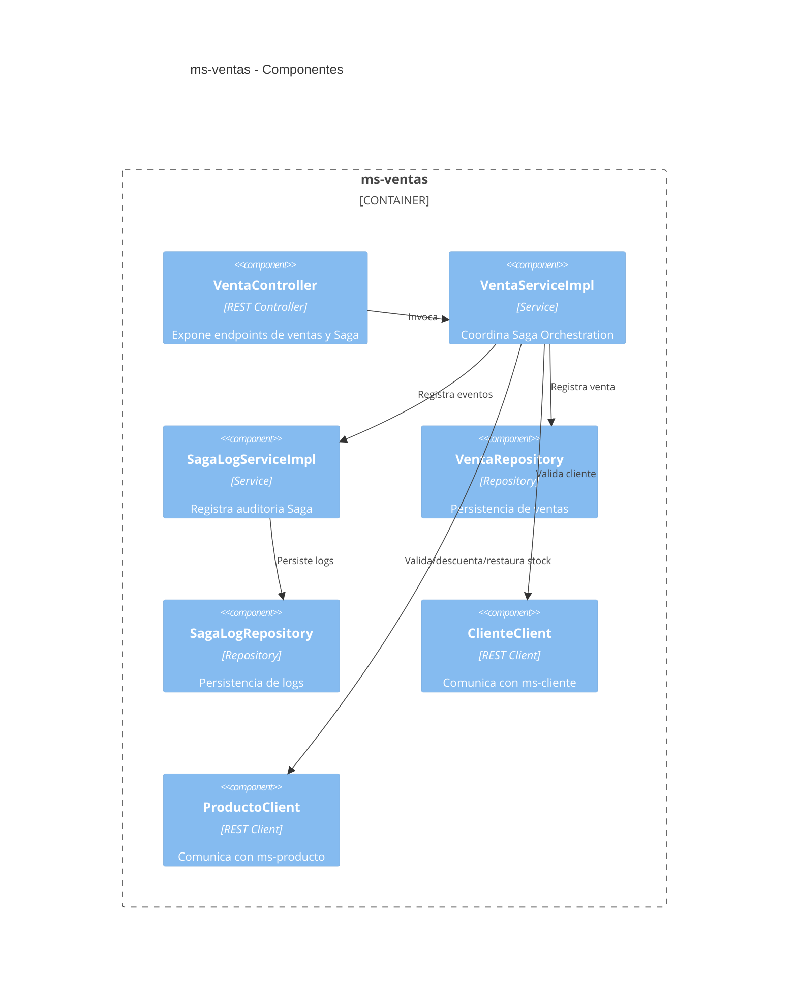

# Informe Final del Proyecto

## Sistema de ventas con microservicios, Quarkus, API Gateway, Consul y Saga Pattern

**Autor:** Samuel Valencia  
**Repositorio Backend:** FINAL-BACK-END  
**Repositorio Frontend:** FINAL-FRONT-END  
**Tecnologias principales:** Quarkus, Docker, Consul, REST Client, JWT, MySQL/Oracle/PostgreSQL, Angular  

---

## 1. Resumen Ejecutivo

El proyecto implementa un sistema distribuido de ventas basado en microservicios. La arquitectura mantiene servicios independientes para autenticacion, clientes, productos y ventas, todos desplegados en contenedores Docker y registrados en Consul para descubrimiento de servicios.

La operacion principal del sistema es la realizacion de una venta mediante el patron **Saga Orchestration**, donde `ms-ventas` coordina el flujo completo: validacion del cliente, validacion del producto, descuento de stock y registro de venta. Si ocurre un error despues del descuento de stock, se ejecuta una compensacion para restaurar el stock.

El sistema tambien incluye seguridad con JWT, API Gateway centralizado, auditoria de Saga logs, manejo de errores funcionales, balanceo mediante dos instancias de `ms-producto`, y un frontend Angular para cliente y administrador.

---

## 2. Descripcion del Problema

En una arquitectura de microservicios, cada servicio posee su propia responsabilidad y su propia fuente de datos. Esto evita acoplamiento fuerte, pero genera un reto importante: mantener consistencia entre operaciones distribuidas.

En el caso del proyecto, una venta depende de varios servicios:

| Paso | Servicio | Responsabilidad |
|---|---|---|
| 1 | `ms-ventas` | Iniciar y coordinar la venta |
| 2 | `ms-cliente` | Validar que el cliente exista y este activo |
| 3 | `ms-producto` | Validar producto y stock disponible |
| 4 | `ms-producto` | Descontar stock |
| 5 | `ms-ventas` | Registrar la venta |

Si el stock se descuenta pero luego falla el registro de la venta, el sistema quedaria inconsistente. Por ello se implementa una Saga con compensacion.

---

## 3. Justificacion Tecnica

Se eligio mantener la arquitectura existente en Quarkus porque el proyecto ya estaba dividido en microservicios funcionales. En lugar de reemplazar servicios, se agrego la coordinacion Saga en `ms-ventas`, respetando la estructura original.

Decisiones principales:

| Decision | Justificacion |
|---|---|
| Mantener Quarkus | El proyecto ya estaba implementado con Quarkus y el requisito indicaba no cambiarlo |
| Usar REST Client | Permite comunicacion sincrona entre microservicios sin usar Kafka o RabbitMQ |
| Usar Saga Orchestration | `ms-ventas` coordina el flujo y centraliza la compensacion |
| Usar Consul | Permite descubrimiento de servicios y evidencia de instancias activas |
| Usar API Gateway | Centraliza el acceso externo a los microservicios |
| Mantener JWT | Protege endpoints administrativos y operaciones del sistema |
| No eliminar clientes fisicamente | Los clientes estan asociados a usuarios y ventas |
| Eliminar productos solo sin ventas | Conserva trazabilidad historica de boletas y ventas |

---

## 4. Objetivos

### Objetivo General

Implementar un sistema de ventas distribuido con microservicios en Quarkus, incorporando Saga Pattern para mantener consistencia de stock y ventas ante fallos.

### Objetivos Especificos

- Implementar autenticacion y autorizacion con JWT.
- Centralizar acceso mediante API Gateway.
- Registrar servicios en Consul.
- Implementar CRUD de clientes y productos.
- Implementar venta coordinada con Saga Orchestration.
- Implementar compensacion de stock ante errores.
- Registrar logs de Saga para auditoria.
- Probar errores funcionales como cliente inactivo y stock insuficiente.
- Implementar frontend Angular para administrador y cliente.
- Documentar evidencias, endpoints, arquitectura y pruebas.

---

## 5. Alcance

El sistema cubre:

- Gestion de usuarios y autenticacion.
- Gestion de clientes.
- Gestion de productos.
- Gestion de ventas.
- Compra mediante Saga.
- Compra por carrito desde frontend.
- Panel administrativo.
- Auditoria de operaciones Saga.
- Despliegue dockerizado.
- Descubrimiento de servicios con Consul.

No incluye pagos reales externos, porque el alcance academico del proyecto no requiere integracion con pasarelas de pago.

---

## 6. Requerimientos Funcionales

| Codigo | Requerimiento | Estado |
|---|---|---|
| RF-01 | Login con JWT | Implementado |
| RF-02 | Registrar cliente junto a usuario | Implementado |
| RF-03 | Listar clientes | Implementado |
| RF-04 | Actualizar cliente | Implementado |
| RF-05 | Activar/desactivar cliente | Implementado |
| RF-06 | Crear producto | Implementado |
| RF-07 | Listar productos | Implementado |
| RF-08 | Actualizar producto | Implementado |
| RF-09 | Activar/desactivar producto | Implementado |
| RF-10 | Eliminar producto sin ventas | Implementado |
| RF-11 | Bloquear eliminacion de producto con ventas | Implementado |
| RF-12 | Realizar venta con Saga | Implementado |
| RF-13 | Validar cliente activo | Implementado |
| RF-14 | Validar stock disponible | Implementado |
| RF-15 | Descontar stock | Implementado |
| RF-16 | Restaurar stock ante fallo posterior al descuento | Implementado |
| RF-17 | Registrar Saga logs | Implementado |
| RF-18 | Mostrar historial de compras | Implementado |

---

## 7. Requerimientos No Funcionales

| Codigo | Requerimiento | Implementacion |
|---|---|---|
| RNF-01 | Seguridad | JWT con roles |
| RNF-02 | Disponibilidad | Servicios dockerizados |
| RNF-03 | Descubrimiento | Consul |
| RNF-04 | Resiliencia | Circuit Breaker, Fallback y Timeout |
| RNF-05 | Trazabilidad | Saga logs |
| RNF-06 | Escalabilidad | Dos instancias de `ms-producto` |
| RNF-07 | Mantenibilidad | Separacion por microservicios |
| RNF-08 | Consistencia eventual | Saga con compensacion |

---

## 8. Casos de Uso

| Caso de Uso | Actor | Descripcion |
|---|---|---|
| CU-01 Login | Administrador / Cliente | Iniciar sesion y recibir token JWT |
| CU-02 Gestionar clientes | Administrador | Listar, actualizar, activar y desactivar clientes |
| CU-03 Gestionar productos | Administrador | Crear, listar, actualizar, activar, desactivar y eliminar productos permitidos |
| CU-04 Comprar producto | Cliente | Realizar compra usando Saga |
| CU-05 Comprar desde admin | Administrador | Realizar compra como cliente/admin |
| CU-06 Ver ventas | Administrador | Consultar ventas globales |
| CU-07 Ver Saga logs | Administrador | Auditar ventas exitosas y fallidas |
| CU-08 Ver mis compras | Cliente | Consultar historial personal |

---

## 9. Historias de Usuario

| Historia | Descripcion | Criterio de Aceptacion |
|---|---|---|
| HU-01 | Como administrador quiero iniciar sesion para gestionar el sistema | El sistema retorna JWT con rol `ROLE_ADMIN` |
| HU-02 | Como cliente quiero crear cuenta para comprar productos | Se crea usuario y cliente asociado |
| HU-03 | Como cliente quiero comprar productos disponibles | La venta se registra y se descuenta stock |
| HU-04 | Como cliente quiero recibir mensaje si no hay stock | Se muestra error controlado |
| HU-05 | Como administrador quiero ver logs de Saga | Se listan errores, pasos fallidos y compensaciones |
| HU-06 | Como administrador quiero evitar borrar productos vendidos | El sistema bloquea eliminacion con HTTP 409 |

---

## 10. Arquitectura C4

### 10.1 Nivel 1: Contexto



### 10.2 Nivel 2: Contenedores



### 10.3 Nivel 3: Componentes de `ms-ventas`



### 10.4 Nivel 4: Codigo Relevante

Fragmento de resiliencia en `VentaServiceImpl`:

```java
@CircuitBreaker(
        requestVolumeThreshold = 4,
        failureRatio = 0.5,
        delay = 5000
)
@Fallback(fallbackMethod = "fallbackProducto")
@Timeout(3000)
public ProductoDTO obtenerProducto(Long id) {
    return productoClient.buscarProductoPorId(id);
}
```

Fragmento de compensacion:

```java
try {
    productoClient.descontarStock(request.idproducto, request.cantidad);
    if (simularFalloDespuesDescuento) {
        throw new RuntimeException("Error simulado despues de descontar stock");
    }
    return registrarVenta(request, sagaId);
} catch (Exception ex) {
    productoClient.restaurarStock(request.idproducto, request.cantidad);
    registrarSagaFallida(sagaId, "ERROR_SIMULADO_POST_DESCUENTO", true);
    throw new ConflictException("No se pudo completar tu compra. Intenta nuevamente.");
}
```

---

## 11. Microservicios Implementados

| Microservicio | Responsabilidad | Puerto |
|---|---|---|
| `api-gateway` | Entrada centralizada | 8030 |
| `ms-auth` | Login, JWT, usuarios y roles | 8084 |
| `ms-cliente` | Gestion y validacion de clientes | 8082 |
| `ms-producto` | Productos y stock | 8080 |
| `ms-producto-2` | Segunda instancia de productos | 8085 |
| `ms-ventas` | Ventas, Saga y auditoria | 8083 |
| `central-config` | Configuracion centralizada | N/A |
| `consul` | Registro y descubrimiento | 8500 |

---

## 12. API REST Documentada

### Autenticacion

| Metodo | Ruta | Descripcion |
|---|---|---|
| POST | `/api/auth/login` | Login y generacion de JWT |

### Clientes

| Metodo | Ruta | Descripcion |
|---|---|---|
| GET | `/api/clientes` | Listar clientes |
| GET | `/api/clientes/{id}` | Buscar cliente |
| PUT | `/api/clientes/{id}` | Actualizar cliente |
| PUT | `/api/clientes/{id}/activar` | Activar cliente |
| PUT | `/api/clientes/{id}/desactivar` | Desactivar cliente |

### Productos

| Metodo | Ruta | Descripcion |
|---|---|---|
| GET | `/api/productos` | Listar productos |
| GET | `/api/productos/{id}` | Buscar producto |
| POST | `/api/productos` | Crear producto |
| PUT | `/api/productos/{id}` | Actualizar producto |
| PUT | `/api/productos/{id}/activar` | Activar producto |
| PUT | `/api/productos/{id}/desactivar` | Desactivar producto |
| DELETE | `/api/productos/{id}` | Eliminar producto solo si no tiene ventas |

### Ventas y Saga

| Metodo | Ruta | Descripcion |
|---|---|---|
| GET | `/api/ventas` | Listar ventas |
| GET | `/api/ventas/{id}` | Buscar venta |
| POST | `/api/ventas/saga` | Ejecutar venta Saga admin |
| POST | `/api/ventas/saga/carrito/cliente` | Ejecutar compra cliente por carrito |
| GET | `/api/ventas/saga-logs` | Listar auditoria Saga |
| GET | `/api/ventas/producto/{idproducto}/conteo` | Contar ventas asociadas a producto |

---

## 13. Evidencias de Implementacion

### 13.1 Docker

La siguiente evidencia muestra los contenedores del proyecto ejecutandose en Docker Desktop:


### 13.2 Consul y Service Discovery

Consul muestra todos los servicios registrados y saludables:


El servicio `ms-producto` registra dos instancias:


### 13.3 JWT

Login del administrador por API Gateway:


### 13.4 CRUD Clientes

Listar clientes:


Actualizar cliente:


Desactivar cliente:


Activar cliente:


### 13.5 CRUD Productos

Crear producto:


Listar productos:


Actualizar producto:


Eliminar producto con ventas bloqueado:


### 13.6 Ventas y Saga

Listado de ventas:


Venta Saga exitosa:


Error por stock insuficiente:


Error por cliente inactivo:


### 13.7 Compensacion Saga

Stock antes:


Error simulado despues del descuento:


Stock restaurado:


### 13.8 Saga Logs

Backend:


Frontend:


### 13.9 Resiliencia

Codigo con Circuit Breaker, Fallback y Timeout:


---

## 14. Frontend Angular

El frontend permite dos flujos principales:

- Cliente: login, registro, tienda, carrito y mis compras.
- Administrador: panel general, clientes, productos, ventas, Saga logs y prueba de Saga.

Pantalla de login cliente:


Pantalla de login administrador:


Panel administrativo:


Gestion de clientes:


Gestion de productos:


Ventas globales:


Saga admin:


Tienda y carrito:


Mis compras:


---

## 15. Repositorios Git

El proyecto fue dividido en repositorio backend y frontend.

Vista general de repositorios:


Repositorio frontend:


Repositorio backend:


---

## 16. Manual Tecnico

### 16.1 Requisitos

- Docker Desktop.
- Java 17 o superior.
- Maven.
- Node.js 18 o superior para frontend.
- Postman.

### 16.2 Ejecucion Backend

Desde la raiz del proyecto backend:

```bash
docker compose up -d --build
```

Servicios principales:

| Servicio | URL |
|---|---|
| API Gateway | `http://localhost:8030` |
| Consul | `http://localhost:8500` |
| ms-auth | `http://localhost:8084` |
| ms-cliente | `http://localhost:8082` |
| ms-producto | `http://localhost:8080` |
| ms-producto-2 | `http://localhost:8085` |
| ms-ventas | `http://localhost:8083` |

### 16.3 Ejecucion Frontend

Desde el proyecto frontend:

```bash
npm install
npm start
```

URL:

```text
http://localhost:4200
```

### 16.4 Login de Prueba

| Usuario | Clave | Rol |
|---|---|---|
| admin | admin123 | ROLE_ADMIN |

---

## 17. Manual de Usuario

### Administrador

1. Ingresar por el boton Admin.
2. Iniciar sesion con usuario administrador.
3. Revisar el resumen del panel.
4. Gestionar clientes.
5. Gestionar productos.
6. Consultar ventas.
7. Revisar Saga logs.
8. Probar ventas Saga y compensacion desde Saga admin.

### Cliente

1. Crear cuenta o iniciar sesion.
2. Ver catalogo de productos.
3. Agregar productos al carrito.
4. Confirmar compra.
5. Revisar historial en Mis compras.

---

## 18. Guion Sugerido Para Sustentacion

1. Presentar el problema de consistencia en microservicios.
2. Mostrar arquitectura general y microservicios.
3. Mostrar Docker con contenedores activos.
4. Mostrar Consul con servicios registrados.
5. Explicar el API Gateway.
6. Mostrar login JWT.
7. Mostrar CRUD clientes y productos.
8. Explicar decision de no eliminar clientes y proteger productos vendidos.
9. Mostrar venta Saga exitosa.
10. Mostrar error por stock insuficiente.
11. Mostrar error por cliente inactivo.
12. Mostrar compensacion de stock.
13. Mostrar Saga logs.
14. Mostrar Circuit Breaker/Fallback/Timeout.
15. Mostrar frontend cliente y administrador.
16. Mostrar GitHub y README.
17. Cerrar explicando beneficios: consistencia, trazabilidad, resiliencia y despliegue dockerizado.

---

## 19. Conclusiones

El proyecto cumple con la implementacion de una arquitectura de microservicios en Quarkus, manteniendo servicios separados y comunicacion mediante REST Client. La incorporacion de Saga Orchestration permite manejar operaciones distribuidas de venta con compensacion de stock ante fallos.

La solucion conserva la trazabilidad mediante Saga logs, protege operaciones con JWT, usa Consul para discovery, Docker para despliegue y Angular como interfaz final. Ademas, se aplicaron decisiones de integridad como no eliminar clientes y bloquear la eliminacion de productos que ya tienen ventas registradas.

---

## 20. Anexos

- Coleccion Postman del proyecto.
- Repositorio backend.
- Repositorio frontend.
- Capturas de Docker, Consul, Postman, codigo y frontend.
- Diagramas C4.
